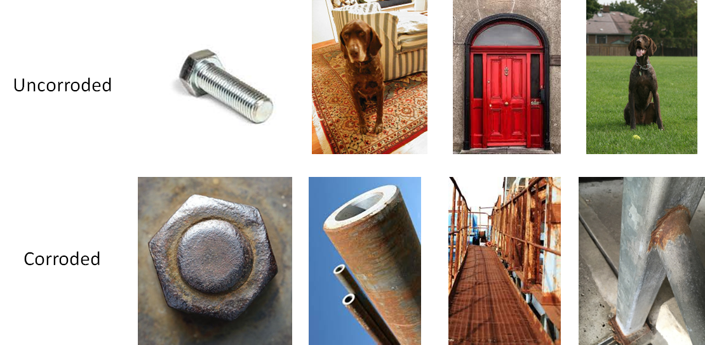
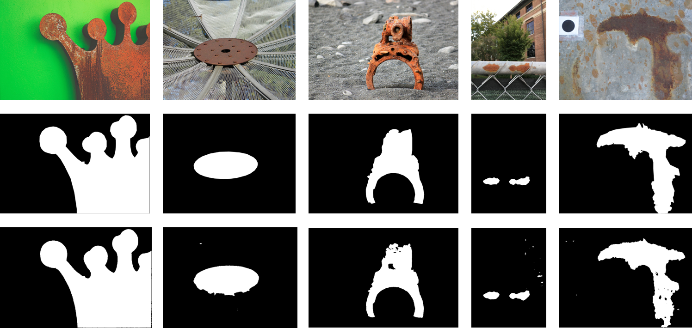

## Corrosion Detection
A small project about corrosion detection (course project).
The pipeline is as follows:

For a given image, use `resnet` for image classification. If it's classified as rust, use `unet` to get the corrosion mask.

### Dataset

All the image from classification dataset are collected from internet (some of them are from [Oxford pet datasets](https://www.robots.ox.ac.uk/~vgg/data/pets/)). The small dataset for corrosion segmentation is annotated by myself ([Annotation tool](https://www.robots.ox.ac.uk/~vgg/software/via/via.html)). Because of the lack of large dataset, the performance might be limited.

### Selected results

- Classification

- Segmentation

- Classification failure cases:

- Segmentation on unlabelled images:
